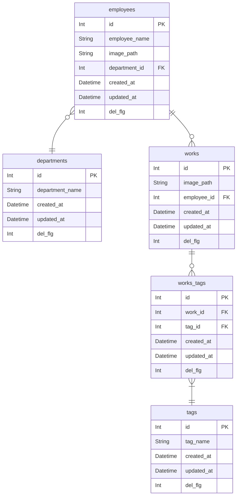

# テーブル定義書
https://docs.google.com/spreadsheets/d/1YI7PosYr0kEsk7xu6z09srFmTVY4t_0YajMqzCt3f2o/edit?usp=sharing

# ER図

```mermaid
erDiagram

employees {
  Int id PK
  String employee_name
  String image_path
  Int department_id FK
  Datetime created_at
  Datetime updated_at
  Int del_flg
}

departments {
  Int id PK
  String department_name
  Datetime created_at
  Datetime updated_at
  Int del_flg
}

works {
  Int id PK
  String image_path
  Int employee_id FK
  Datetime created_at
  Datetime updated_at
  Int del_flg
}

tags {
  Int id PK
  String tag_name
  Datetime created_at
  Datetime updated_at
  Int del_flg
}

works_tags {
  Int id PK
  Int work_id FK
  Int tag_id FK
  Datetime created_at
  Datetime updated_at
  Int del_flg
}

employees }o--|| departments: ""
employees ||--o{ works: ""
works ||--o{ works_tags: ""
works_tags }|--|| tags: ""
```
