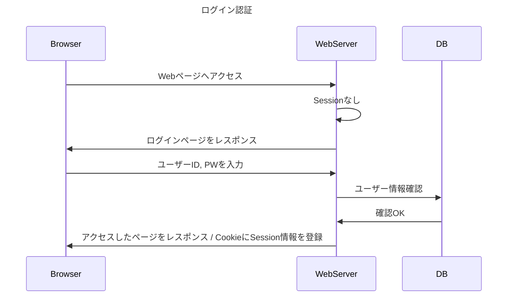
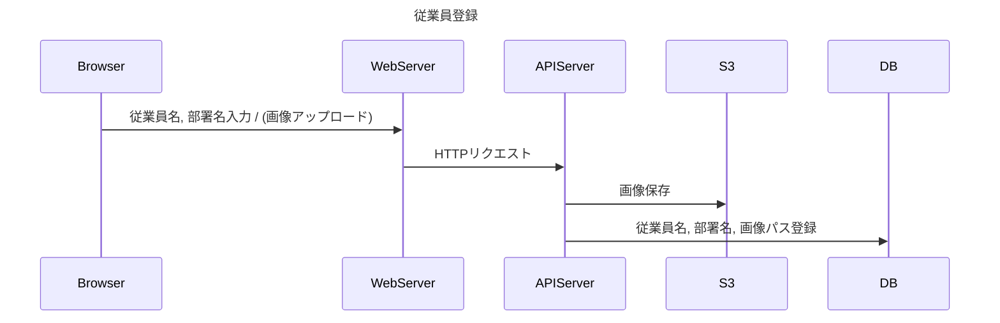
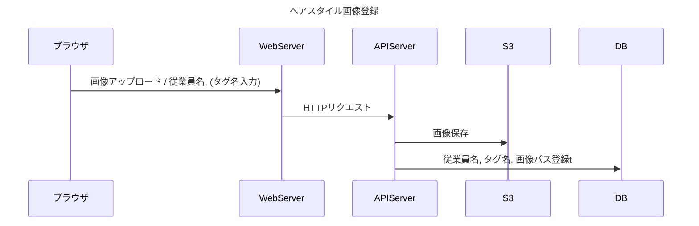

```mermaid
sequenceDiagram
title: ログイン認証
Browser ->> WebServer: Webページへアクセス
WebServer ->> WebServer: Sessionなし
WebServer ->> Browser: ログインページをレスポンス
Browser ->> WebServer: ユーザーID, PWを入力
WebServer ->> DB: ユーザー情報確認
DB ->> WebServer: 確認OK
WebServer ->> Browser: アクセスしたページをレスポンス / CookieにSession情報を登録
```

```mermaid
sequenceDiagram
title: 従業員登録
Browser ->> WebServer: 従業員名, 部署名入力 / (画像アップロード)
WebServer ->> APIServer: HTTPリクエスト
APIServer ->> S3: 画像保存
APIServer ->> DB: 従業員名, 部署名, 画像パス登録
```

```mermaid
sequenceDiagram
title: ヘアスタイル画像登録
ブラウザ ->> WebServer: 画像アップロード / 従業員名, (タグ名入力)
WebServer ->> APIServer: HTTPリクエスト
APIServer ->> S3: 画像保存
APIServer ->> DB: 従業員名, タグ名, 画像パス登録t
```